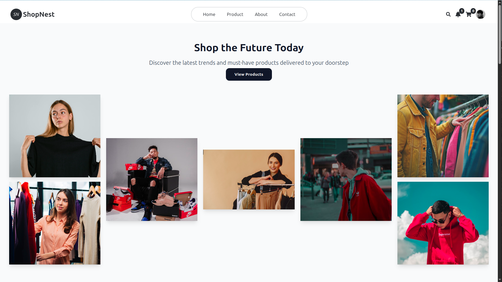
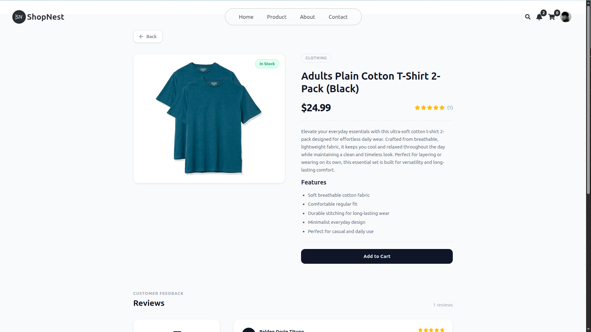
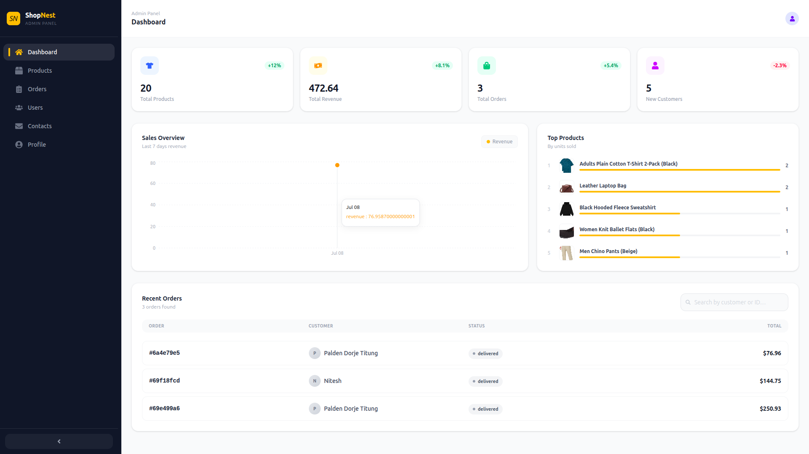

# 🛍️ ShopNest

A full-stack MERN e-commerce platform covering the complete shopping journey — product discovery, cart, checkout, and order tracking — backed by an admin dashboard for managing products, orders, and users.

[](https://shopnest-beta-three.vercel.app/)


---

## Screenshots

| Home                                    | Product Page                                  | Admin Dashboard                           |
| --------------------------------------- | --------------------------------------------- | ----------------------------------------- |
|  |  |  |

---

## Features

### Customer-facing

- **Authentication** — JWT-based register/login with hashed passwords (bcrypt).
- **Product discovery** — Search and filtering across the catalog.
- **Cart** — Live quantity and total updates as items are added or removed.
- **Wishlist** — Save products for later without adding them to the cart.
- **Checkout** — Multi-step flow from cart review to order confirmation.
- **Reviews** — Star ratings and written reviews on products.
- **Order history** — Track past orders and their current status.
- **Notifications** — In-app alerts for order and account updates.
- **Profile management** — Update account details and saved information.

### Admin panel

- **Analytics dashboard** — Charted overview of sales/orders (Recharts).
- **Product management** — Full CRUD with image upload via Multer, stored on Cloudinary.
- **Order management** — View and update order status across the platform.
- **User management** — Block/unblock accounts.
- **Contact inbox** — View and respond to customer messages.

---

## Tech Stack

| Layer         | Technology                   |
| ------------- | ---------------------------- |
| Frontend      | React 19, Vite 7             |
| Styling       | Tailwind CSS v4              |
| Animations    | Framer Motion                |
| Charts        | Recharts                     |
| Routing       | React Router v7              |
| Alerts/Toasts | SweetAlert2, React Hot Toast |
| Backend       | Node.js, Express 5           |
| Database      | MongoDB (Mongoose)           |
| Auth          | JWT, bcryptjs                |
| File Upload   | Multer                       |
| Image Storage | Cloudinary                   |
| Email         | Nodemailer                   |

---

## Architecture

**Backend:** `Routes → Controllers → Services → Models → Database`
Keeps request handling, business logic, and data access in separate layers so each piece can be tested and changed independently.

**Frontend:** `Pages → Components → Context → API Services`
Global state (auth, cart, etc.) lives in Context; API calls are isolated in a services layer so components stay focused on rendering.

---

## Project Structure

```
ShopNest/
├── backend/
│   ├── controllers/
│   ├── models/
│   ├── routes/
│   ├── middleware/
│   ├── services/
│   └── utils/
└── frontend/
    ├── Components/
    ├── Pages/
    ├── Context/
    ├── Hooks/
    └── Services/
```

---

## Getting Started

### Prerequisites

- Node.js 18+
- A MongoDB instance (local or [MongoDB Atlas](https://www.mongodb.com/atlas))

### 1. Clone the repo

```bash
git clone https://github.com/paldentitung/shopnest.git
cd shopnest
```

### 2. Backend setup

```bash
cd backend
npm install
```

Create a `.env` file in `backend/`:

```env
PORT=5000
MONGO_URI=your_mongo_uri
JWT_SECRET=your_secret
CLOUDINARY_CLOUD_NAME=your_cloud_name
CLOUDINARY_API_KEY=your_api_key
CLOUDINARY_API_SECRET=your_api_secret
```

Run the server:

```bash
npm run dev
```

### 3. Frontend setup

```bash
cd frontend
npm install
npm run dev
```

---

## Security

- Passwords hashed with bcrypt
- JWT-based session authentication
- Role-based access control (Admin/User)
- Protected API routes via auth middleware
- Secrets kept out of source control via environment variables

---

## Contributing

Pull requests are welcome.

```bash
git checkout -b feature/your-feature
git commit -m "Add feature"
git push origin feature/your-feature
```

---

## Author

**Palden Dorje Titung**
GitHub: [@paldentitung](https://github.com/paldentitung)

---

## License

MIT
